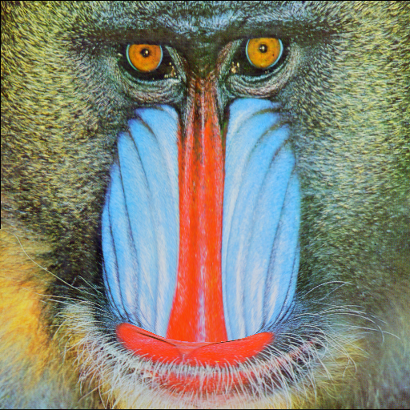
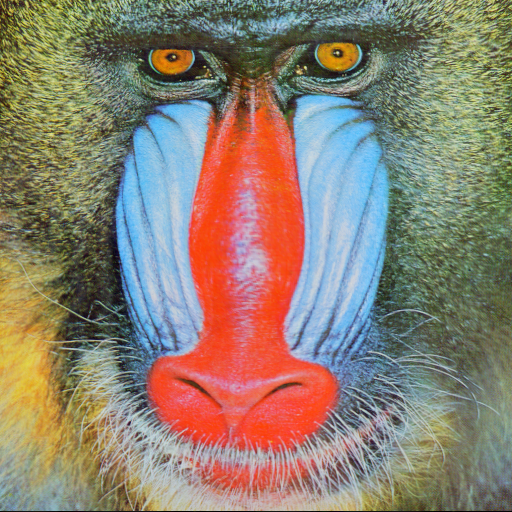
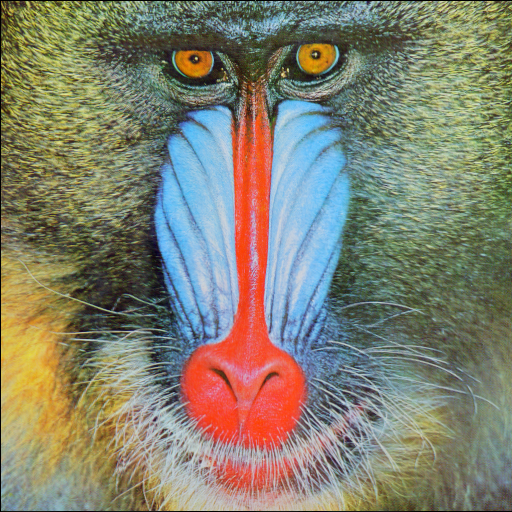
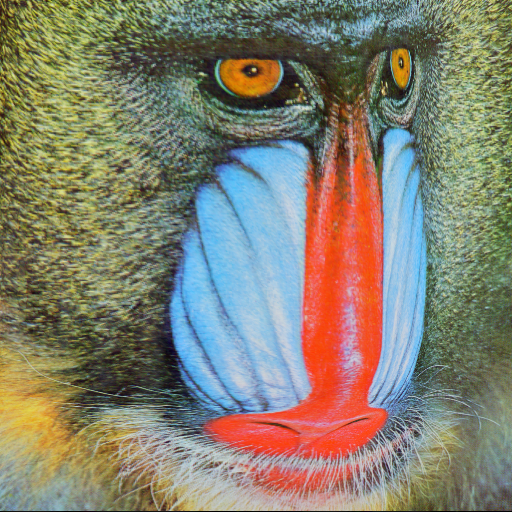
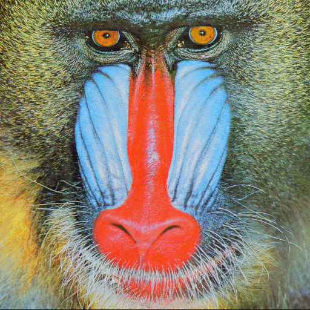

# KelvinletsImage.jl

Implementation for Kelvinlets Deformations presented on 
[Regularized Kelvinlets: Sculpting Brushes based on Fundamental Solutions of Elasticity](https://graphics.pixar.com/library/Kelvinlets/paper.pdf) 
from *Fernando De Goes* and *Doug L. James* on **Julia v1.0**.

Deformations for the *Grab*, *Scale* and *Pinch* brushes. Including a **Rectangle** brush for the *Grab* function.

---

## Usage

### Initialization

You must first initialize the structure **KelvinletsObject** to start deforming a given image. To do that you must first select an image end define a *poisson ratio* **ν** and an *elastic shear modulus* **μ** (both of them are explained on the above paper).


```julia
    using KelvinletsImage, TestImages

    ν = 0.4
    μ = 1.0
    image = testimages("mandrill")

    object = KelvinletsObject(image, ν, μ)
```


After initializing the presented object, you will use ir for further operations.

### Grab Brush


```julia
    using KelvinletsImage

    pressurePosition = [256, 256]
    forceVector = [200., 0.]
    ϵ = 70. # Brush Size
    grabbedImage = grab(object, pressurePosition, forceVector, ϵ)
```



```julia
    using KelvinletsImage

    frames = 20
    grabbedImageGIF = makeVideo(object, grab, pressurePosition, forceVector, ϵ, frames)
```


### Scale Brush


```julia
    using KelvinletsImage

    pressurePosition = [256, 256]
    scale = -200000. # Negative value = inflates .. Positive Value = Contracts
    ϵ = 70. # Brush Size
    scaledImage = scale(object, pressurePosition, forceVector, ϵ)
```



```julia
    using KelvinletsImage

    frames = 20
    grabbedImageGIF = makeVideo(object, scale, pressurePosition, scale, ϵ, frames)
```


### Pinch Brush


```julia
    using KelvinletsImage

    pressurePosition = [256, 256]
    forceMatrix = [0. 0.; 0. 300000.]
    ϵ = 300. # Brush Size
    grabbedImage = pinch(object, pressurePosition, forceMatrix, ϵ)
```



```julia
    using KelvinletsImage

    frames = 20
    grabbedImageGIF = makeVideo(object, pinch, pressurePosition, forceMatrix, ϵ, frames)
```


### Grab Rectangle Brush


```julia
    using KelvinletsImage

    pressureRectangle = [156 156; 256 256]
    forceVector = [150., 150.]
    ϵ = 50. # Brush Size
    grabbedImage = pinch(object, pressureRectangle, forceVector, ϵ)
```



```julia
    using KelvinletsImage

    frames = 20
    grabbedImageGIF = makeVideo(object, grabRectangle, pressureRectangle, forceVector, ϵ, frames)
```


